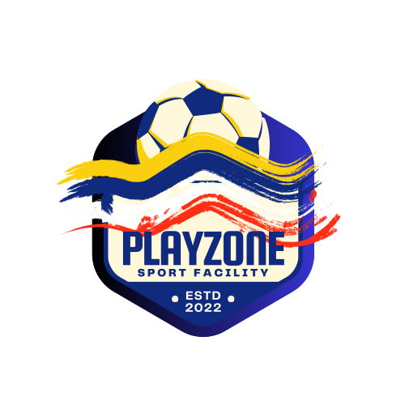

<div align="center">
  
</div>
# PlayZone: Sports Facility Booking System

## Project Overview

**PlayZone** is a comprehensive **Sports Facility Booking System** designed to simplify the process of reserving and paying for sports facilities. The system is available both as a **Web Application** and an **Android Application**, offering users a seamless experience for booking and managing their facility reservations.

## Features

### Web Application
- **User Registration and Login:** Easy account creation and secure login for users.
- **Facility Search and Booking:** Browse and book available sports facilities with real-time availability checks.
- **Payment Integration:** Secure payment processing to finalize bookings.
- **Admin Dashboard:** Manage facilities, monitor bookings, and generate reports for efficient facility management.

### Android Application
- **Mobile Convenience:** Access PlayZone anytime, anywhere through the Android app.
- **Push Notifications:** Receive instant notifications for booking confirmations, reminders, and updates.
- **User-friendly Interface:** Intuitive mobile design for effortless navigation.

## Technologies Used

### Web Application
- **Frontend:** HTML, CSS, JavaScript
- **Backend:** PHP, SQL (Database)
- **Frameworks/Libraries:** Bootstrap for responsive design
- **Payment Gateway:** PayPal API (or other payment services)

### Android Application
- **Programming Language:** Java/Kotlin
- **Framework:** Android SDK
- **Database:** Firebase/SQLite for local storage
- **API Integration:** RESTful API for communication with the web server

## Installation and Setup

### Web Application
1. **Clone the repository:**
   ```bash
   git clone https://github.com/MouriCok/playzone.git
   ```
2. **Navigate to the project directory:**
   ```bash
   cd playzone
   ```
3. **Configure the database:**
   - Import the provided SQL file (`admin.sql`, `customer.sql`, `bookings.sql`, `timeframe.sql`) into your MySQL or phpMyAdmin database.
   - Update the database connection details in `database.php`.

4. **Run the application on your local server (e.g., XAMPP, WAMP):**
   - Start Apache and MySQL.
   - Access the application via `http://localhost/playzone`.

### Android Application
1. **Clone the repository:**
   ```bash
   git clone https://github.com/MouriCok/playzone-android.git
   ```
2. **Open the project in Android Studio.**
3. **Configure the API URLs and dependencies.**
4. **Run the app on an emulator or a physical device.**

## Usage

1. **Sign up or log in to your PlayZone account.**
2. **Explore available sports facilities.**
3. **Select a facility, choose your preferred date and time, and make a reservation.**
4. **Complete the payment through the integrated payment gateway.**
5. **Receive booking confirmation via email and mobile notifications.**

## Future Enhancements
- **iOS App Development:** Expand PlayZone to iOS devices.
- **Additional Payment Options:** Support for more payment methods like Stripe, Google Pay, etc.
- **Advanced Analytics:** Implement detailed analytics and reporting features for facility management.

## Contributing
Contributions are not welcome right now because this is just a Project to get my Degree in Computer Science.

## Contact
For any questions or feedback, feel free to reach out:

- **Email:** [mbukhoury.mb@gmail.com](mailto:mbukhoury.mb@gmail.com)
- **GitHub Repository:** [PlayZone](https://github.com/MouriCok/playzone)
